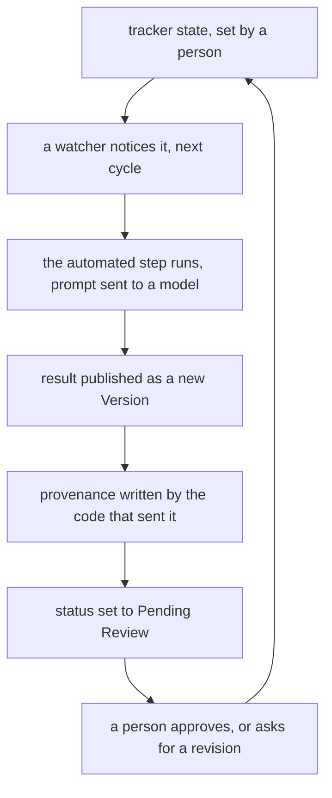
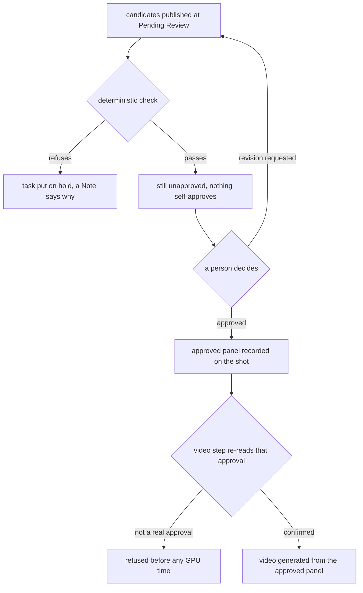

# signalbox

A generative pipeline where the production tracker pulls every lever: notes, approvals, and status
changes in ShotGrid are the only control surface, and nothing moves past a signal a human hasn't set.
Video generation is what happens to be running through it here, but the signals, the gates, and the
record of who pulled which one are the actual subject. The same pattern works for any expensive
automated step, AI or not, sitting behind a tracker a team already uses.

Built and run on a single 12 GB consumer GPU against a hosted ShotGrid site, producing an
in-development animated short.

```
Note -> Revision requested (human) -> Model -> Panel -> Approve (human) -> Video -> Approve (human) -> Cut
```

## The problem

A generative model is a probabilistic step, and most pipelines built around one do the same thing:
they either skip review and ship whatever came out, or they bolt on a separate admin tool that
nobody on the actual production opens. Neither survives contact with a real show. The alternative is
to make the tool the production already lives in, the tracker, the trigger and the record: an
operator's own note and approval are the interface, and every automatic step is auditable back to
the human decision that started it.

## What it does

```
operator writes a NOTE on a shot
  -> operator sets the Version to REVISION REQUESTED     <- the trigger, a human
  -> the note and the current prompt components go to a model
  -> the revised prompt is applied and the shot requeued, automatically
  -> panel recomposed, candidates published for review
  -> operator APPROVES one panel                         <- gate 1, a human
  -> the video queues itself from that approved panel
  -> operator APPROVES the video                         <- gate 2, a human
  -> the episode cut rebuilds from latest-approved, automatically
```

The same path, drawn as the cycle it actually is:



There is no queue and no job file. Every arrow reads or writes a field in the production tracker, so
the record of what ran, and of who asked for it, lands back in the tool the production already uses.

Every automatic step is automatic. Every gate is a person. A pipeline that regenerated without
asking would be worth less, not more: the gates are the product, and the record of who passed which
one is what a production actually buys.

Characters stay on-model because every shot composites from an **approved design**, not a prompt
that hopefully describes the same person twice: an approved character, an approved set, and a
sentence of action go into an edit model together, one frame comes out. That is why the same
character survives across a sequence.

## What makes this different from a render script

**It records what it actually sent, and checks the record against it.** The stored provenance for a
shot is compared against the prompt the model actually received, and a disagreement is posted as a
Note on the Version rather than left in a log nobody reads. It reports rather than blocks: a
provenance mismatch is a reporting defect, not a reason to throw away a rendered frame. "The record
says we sent it" is not evidence that it was sent.

**It gates deterministically, not with a vision model.** A vision-model QC gate was built, measured
at 38% pass on correct panels, and switched off: attribute checklists conflate identity with pose,
and a legitimate close-up crops something out of frame. What replaced it are checks that compare
against a reference rather than asking a model to judge quality, the same discipline a VFX pipeline
already applies to every other automated step.

**It deploys through a seam, atomically.** Every release is staged, every module's own self-test
runs as preflight, and a release only activates on a clean pass. A pointer file names the one
currently running, so "what does this machine actually execute" always has an answer.

**Every tool carries its own self-test, and the tests have proven failure modes.** A check nobody
has seen fail is not evidence, so a canary is planted and confirmed to trip before a clean result is
trusted anywhere in this pipeline.

Where a human decision has to enter, and what the pipeline will not do without one:



A deterministic check can only refuse, never approve: it parks the work and says why, and the
decision itself stays with a person. The one step that costs GPU time re-reads the approval on the
way in rather than trusting the link it was handed.

## Measured, not assumed

- **Bit-deterministic on one box.** Identical inputs produced byte-identical output across separate
  runs 40 minutes apart, 4 of 4 replicate pairs. Differences between test arms are signal, not
  run-to-run noise.
- **A sampler setting made negative prompts silently inert**, confirmed pixel-identical against the
  fix rather than assumed from the docs. Every fast recipe in this pipeline runs there, so every
  prompt is written as what IS in frame, never as an exclusion that would go unread.
- **Two distinct characters in one frame is an open research problem**, not a bug in this stack. It
  has names in the literature and is worst for same-class subjects, which is every two-hander.
  Measured across test shots rather than declared solved.
- **Most "model limitations" on the first pass were the prompt.** Read what was actually sent before
  blaming the model.

## What a human still decided

The generation is mostly agent-written, under direction. What is not agent-written is the judgment
that makes the system trustworthy: which steps had to be made deterministic rather than left to a
model's opinion, where a human had to be the one to say yes, what evidence a check has to produce
before a clean result gets believed, and which AI component to switch off the moment it measured
badly instead of tuning around a number that would not move. Directing a team of agents to build a
production system, and knowing how to verify what they built, is the actual subject of this repo.

## Layout

| path | what |
|---|---|
| `tools/genvideo_service.py` | the standing service: watchers for notes, proposals, panels, video queue, animatics, design approvals |
| `tools/deploy.py` | the deploy seam: stages, preflights, activates atomically, supports rollback |
| `tools/provenance_vs_sent.py` | the provenance gate: what was recorded against what was actually sent |
| `tools/figure_count_qc.py` | the deterministic check that replaced a vision model measured at 38% |
| `workflows/*.api.json` | ComfyUI workflow templates for each generation stage |
| `docs/ARCHITECTURE.md` | why it is built this way, and what each choice cost |
| `docs/METHOD.md` | the wedge method, and three findings that shaped the design |
| `docs/OPERATOR-GUIDE.md` | how to drive it all from the tracker |
| `docs/MODEL-LICENCE-RECORD.md` | per-model licence position: weights, output rights, training provenance |
| `docs/TWO-CHARACTER-PROBLEM.md` | the open research problem, what was measured, and what the field knows |

## Notes & scope

- This is an extract of a larger internal system, built for one production and trimmed to the
  show-agnostic core: the watcher loop, the deploy seam, the provenance gate, the deterministic QC.
  Character-consistency research experiments and production-specific data are not part of this
  publication.
- It is published as a snapshot. The system it is drawn from has its own history, which stays on
  private infrastructure.
- Self-tests that need the original GPU models, ffmpeg, or a live ShotGrid connection will not pass
  from a clone; this is meant to be read, not stood up.

## License

MIT. See [LICENSE](LICENSE).

## Built by

Geoffrey Hancock, a VFX supervisor and producer who builds production tooling and orchestrates AI
agents on real film and animation productions. signalbox is the generation half of that work.

- The method, as a course: [join the waitlist](https://thevfxsupervisor.github.io/course/)
- More: [thevfxsupervisor.github.io](https://thevfxsupervisor.github.io/)
